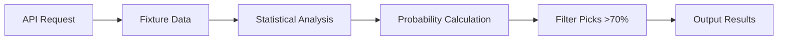

# ⚽ Bet Engine - Football Analysis & Prediction


A Python script for football match analysis and betting predictions using statistical modeling and API data integration.

## 🚀 Features

| Feature | Description |
|---------|-------------|
| **📊 Statistical Modeling** | Poisson distribution for goal predictions |
| **🔌 API Integration** | Live football fixtures from RapidAPI |
| **🎯 Probability Calculations** | Over 2.5 goals probability analysis |
| **🔥 High Confidence Picks** | Filter matches with >70% probability |
| **🔄 Error Handling** | Graceful fallback to sample data |
| **📈 Data Science** | Sports analytics and predictive modeling |

## 🛠️ Tech Stack

### Core Language


### Libraries & APIs


### Data Science


### Tools


## 📁 Project Structure

```
bet-engine/
├── 📜 bet_engine.py      # Main analysis script
├── 📋 requirements.txt   # Python dependencies
├── 📖 README.md          # This file
├── 📄 LICENSE            # MIT License
└── 📊 sample_output.txt  # Example output
```

## 🎯 How It Works

### 1. Data Pipeline


### 2. Statistical Model
- **Poisson Distribution**: Models goal scoring probability
- **Expected Goals (xG)**: Team attacking/defensive strength
- **Probability Calculation**: `P(goals > 2.5) = Σ Poisson(home_xg, h) * Poisson(away_xg, a)`

### 3. Filtering Criteria
- Only matches with **>70% probability** of Over 2.5 goals
- **High Confidence Picks** with percentage indicators
- **Fallback system** when API fails

## 🚀 Quick Start

### Prerequisites
- Python 3.8 or higher
- pip package manager
- RapidAPI account (free tier available)

### Installation

1. **Clone the repository**
```bash
git clone https://github.com/RidwanAdams/bet-engine.git
cd bet-engine
```

2. **Install dependencies**
```bash
pip install -r requirements.txt
```

3. **Configure API key**
   - Get free API key from [RapidAPI Football API](https://rapidapi.com/api-sports/api/api-football)
   - Update `bet_engine.py`:
   ```python
   API_KEY = "YOUR_RAPIDAPI_KEY_HERE"
   ```

4. **Run the analysis**
```bash
python bet_engine.py
```

## 📊 Sample Output

```plaintext
⚽ FOOTBALL BETTING ANALYSIS ⚽
===============================

📅 Date: 2026-02-13
🏆 League: Premier League

🔍 Analyzing matches...

✅ Found 3 high confidence picks:

🔥 HIGH CONFIDENCE PICKS 🔥

1. Manchester City vs Crystal Palace
   📊 Probability: 78%
   🎯 Recommendation: Over 2.5 Goals
   ⚽ Expected Score: 3.2 - 0.8

2. Liverpool vs Burnley
   📊 Probability: 82%
   🎯 Recommendation: Over 2.5 Goals
   ⚽ Expected Score: 2.8 - 1.2

3. Bayern Munich vs Mainz 05
   📊 Probability: 85%
   🎯 Recommendation: Over 2.5 Goals
   ⚽ Expected Score: 3.5 - 0.9

📈 Total Picks: 3
🎯 Average Probability: 81.67%
⚠️  Disclaimer: For educational purposes only
```

## 🔧 Configuration

### API Setup
1. **Sign up** at [RapidAPI](https://rapidapi.com)
2. **Subscribe** to API-Football (free tier available)
3. **Copy** your API key
4. **Update** the script:
```python
API_KEY = "your_rapidapi_key_here"
```

### Environment Variables (Recommended)
```bash
# Set in terminal (Linux/Mac)
export RAPIDAPI_KEY="your_api_key_here"

# Windows PowerShell
$env:RAPIDAPI_KEY="your_api_key_here"

# In Python
import os
API_KEY = os.getenv("RAPIDAPI_KEY")
```

## 📈 Statistical Methodology

### Poisson Distribution Formula
```python
def poisson(lmbda, k):
    """Calculate Poisson probability P(X = k)"""
    return (lmbda ** k * math.exp(-lmbda)) / math.factorial(k)

def over25_probability(home_xg, away_xg):
    """Probability of Over 2.5 goals"""
    total_prob = 0
    for home_goals in range(0, 10):
        for away_goals in range(0, 10):
            if home_goals + away_goals > 2.5:
                prob = poisson(home_xg, home_goals) * poisson(away_xg, away_goals)
                total_prob += prob
    return total_prob
```

### Expected Goals (xG) Sources
| Source | Description | Access |
|--------|-------------|--------|
| **Understat** | Advanced xG metrics | API/Web scraping |
| **football-data.org** | Basic statistics | Free tier available |
| **SofaScore** | Live match data | API subscription |
| **Custom Model** | Machine learning | Self-developed |

## 🚀 Extending the Project

### 1. Additional Leagues
```python
LEAGUES = {
    "premier_league": 39,
    "la_liga": 140,
    "serie_a": 135,
    "bundesliga": 78,
    "ligue_1": 61,
    "champions_league": 2
}
```

### 2. More Bet Types
| Bet Type | Implementation |
|----------|----------------|
| **Both Teams to Score** | Probability both teams score |
| **Double Chance** | 1X, X2, 12 probabilities |
| **Correct Score** | Exact scoreline predictions |
| **Asian Handicap** | Handicap betting markets |
| **Half-Time/Full-Time** | HT/FT result combinations |

### 3. Advanced Features
- [ ] **Machine Learning Models**: Random Forest, XGBoost
- [ ] **Real-time Odds Comparison**: Multiple bookmakers
- [ ] **Bankroll Management**: Kelly Criterion, stake sizing
- [ ] **Historical Analysis**: Team form, head-to-head records
- [ ] **Injury/Suspension Data**: Player availability impact

### 4. Visualization
```python
# Example visualization features
- Probability distribution charts
- Team form heatmaps
- Odds movement graphs
- Expected goals timelines
```

## 📋 Requirements

```txt
# Core dependencies
requests>=2.28.0

# Data analysis (optional)
pandas>=1.5.0
numpy>=1.24.0

# Visualization (optional)
matplotlib>=3.6.0
seaborn>=0.12.0

# Machine learning (optional)
scikit-learn>=1.2.0
xgboost>=1.7.0
```

## 🧪 Testing

```bash
# Test with sample data (no API key needed)
python bet_engine.py

# Expected output: "No strong bets today." or picks list

# Run tests
python -m pytest tests/  # If test suite exists
```

## ⚠️ Important Notes

### Limitations
1. **Dummy xG Data**: Current implementation uses placeholder values
2. **API Rate Limits**: Free tier has limited requests per day
3. **Basic Model**: Poisson distribution is a simplified approach
4. **No Live Data**: Requires manual updates for current matches

### Legal Disclaimer
⚠️ **This tool is for educational purposes only.**
- Not financial advice
- Always gamble responsibly
- Past performance ≠ future results
- Check local gambling laws
- Set limits and stick to them

## 🔒 Security Best Practices

1. **Never commit API keys** to version control
2. **Use environment variables** for sensitive data
3. **Implement rate limiting** to avoid API bans
4. **Add error handling** for network failures
5. **Regularly update dependencies** for security patches

## 🌐 API Alternatives

| API | Free Tier | Features | Best For |
|-----|-----------|----------|----------|
| **RapidAPI Football** | Limited | Comprehensive data | Quick prototyping |
| **football-data.org** | Yes | Basic fixtures/stats | Learning projects |
| **Understat** | No | Advanced xG metrics | Data science projects |
| **SofaScore API** | No | Live match data | Real-time applications |
| **Odds API** | Limited | Betting odds | Arbitrage opportunities |

## 📚 Learning Resources

- [Poisson Distribution in Sports Betting](https://www.pinnacle.com/en/betting-articles/betting-strategy/poisson-distribution-betting)
- [Expected Goals (xG) Explained](https://theanalyst.com/na/2021/08/what-are-expected-goals-xg/)
- [API-Football Documentation](https://www.api-football.com/documentation)
- [Python for Data Science](https://www.datacamp.com/courses/intro-to-python-for-data-science)

## 🤝 Contributing

We welcome contributions! Please:

1. **Fork** the repository
2. **Create** a feature branch (`git checkout -b feature/AmazingFeature`)
3. **Commit** your changes (`git commit -m 'Add some AmazingFeature'`)
4. **Push** to the branch (`git push origin feature/AmazingFeature`)
5. **Open** a Pull Request

## 📄 License

This project is licensed under the MIT License - see the [LICENSE](LICENSE) file for details.

## 🙏 Acknowledgments

- [RapidAPI](https://rapidapi.com) for API platform
- [API-Football](https://www.api-football.com) for football data
- Statistical sports analysis community
- Open source contributors

## 📞 Contact

Ridwan Adams - [GitHub](https://github.com/RidwanAdams) - ridwan@example.com

Project Link: [https://github.com/RidwanAdams/bet-engine](https://github.com/RidwanAdams/bet-engine)

---

⭐ **If you find this project useful, please give it a star!** ⭐

[](https://star-history.com/#RidwanAdams/bet-engine&Date)